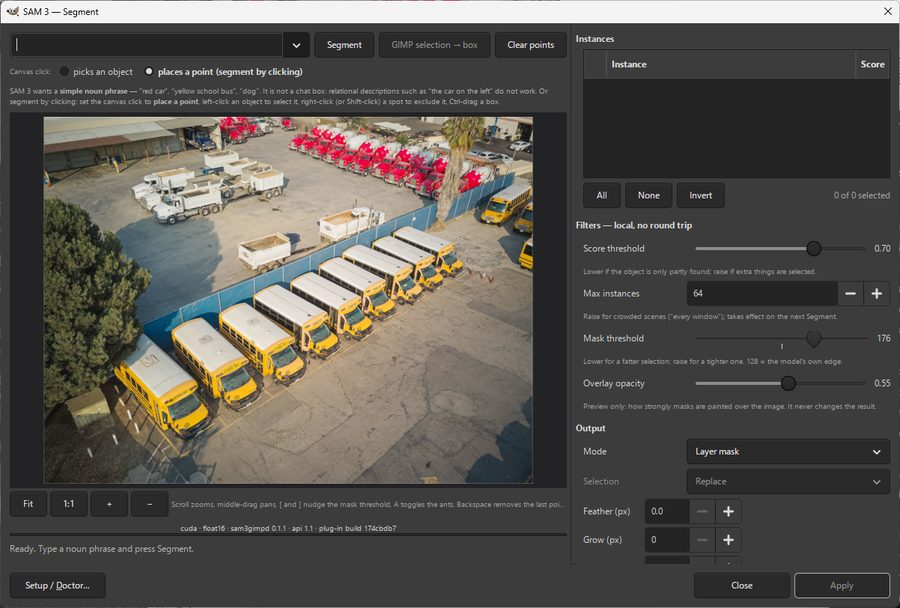
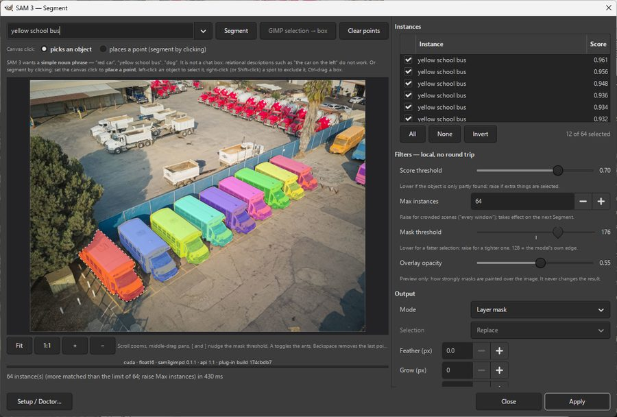
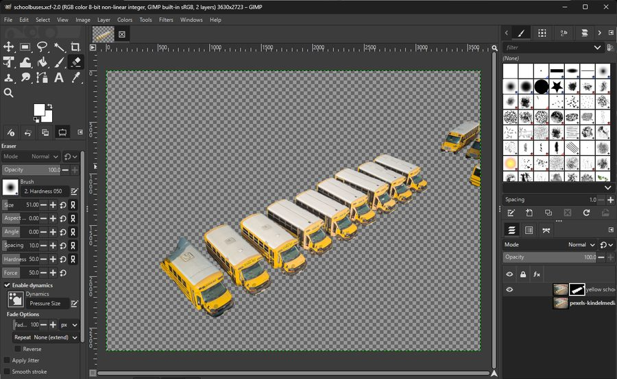

# gimp-sam3-plugin

Segmentation for GIMP 3 with [Meta SAM 3](https://huggingface.co/facebook/sam3).

Type `yellow school bus` and every bus in the image comes back as its own selection. Or click
on a thing and get a mask for that one thing. The result can be a selection, saved channels,
a layer mask, a layer group or vector paths. Inference runs in a background process that
keeps the image embedding in memory, so the second prompt on an image takes milliseconds.

## What it looks like

|  |  |
|---|---|
| **1.** The plug-in's window on a photo of a vehicle yard, before any prompt. | **2.** `yellow school bus`: each bus comes back as its own scored instance, in 430 ms. The dump trucks and cement mixers are left alone. |



**3.** *Apply* in *Layer mask* mode: back in GIMP, a new layer whose mask keeps only the buses.

## Two ways to ask

SAM 3 ships two models in one checkpoint, and the plug-in exposes both.

| | How you ask | What comes back | In the window |
|---|---|---|---|
| Text prompt | a noun phrase: `red car`, `person`, `leaf` | every matching object, each with a score | the prompt box and *Segment* |
| Point prompt | clicks and boxes on the object | one mask, refined by each further click | the preview, with the canvas click set to *places a point* |

The text prompt finds every instance of a thing it can name. The point prompt finds the thing
under the pointer and does not need a name for it, so it handles the strap, the cable, the
odd-shaped offcut that no phrase describes. The two combine: with a phrase typed, a box you
draw or a selection you made in GIMP becomes an *example* of what the phrase means.

## The window

**Prompting**

* Text prompt with a drop-down of your last twenty phrases. Results are capped by a
  *Max instances* you set (default 64, up to 256).
* Canvas click mode: *picks an object* (click a result to tick or untick it) or *places a
  point* (left-click to segment, right-click or Shift-click to exclude a spot, Ctrl-drag a
  box). A lone click returns up to three candidates with the best ticked; a second point
  settles it to one mask. Backspace removes the last point and re-runs, Esc clears them.
* *GIMP selection → box*: a selection drawn in GIMP's own window becomes a box prompt, or
  an example box for the current phrase.
* A prompt sent while another runs supersedes it; the late result is dropped.
* Refining reuses the cached image embedding, so the image is not encoded again.

**The preview**

* The image with translucent per-object overlays, marching ants on the active object, a
  label-and-score badge on the hovered one, points and boxes drawn where you put them.
* Scroll or the Fit / 1:1 / + / − buttons to zoom, middle-drag to pan, `[` and `]` to nudge
  the mask threshold, `A` to toggle the ants.
* The instance list mirrors the preview: clicking an object selects its row, ticking a row
  shows or hides its overlay, and *All*, *None* and *Invert* act on every row.

**Filtering, all local**

Masks arrive as cropped soft 8-bit masks. The score slider decides which objects count, the
mask-threshold slider decides how much of each mask counts, and both re-threshold bytes
already in memory, with no round trip to the daemon.

**Outputs, each a single undo step**

| Output | What it makes |
|---|---|
| Selection | The ticked objects combined with the existing selection by replace, add, subtract or intersect. |
| Channels | One saved channel per object, named from the phrase and score, in the Channels dialog. |
| Layer mask | The objects as a mask on a copy of the source layer (or on the layer itself). |
| Layer group | A group holding one masked copy of the source layer per object. |
| Paths | One vector path per object, traced from the mask edge and fitted with Béziers, in the Paths dialog. |

Post-processing before any of them: threshold, edge softness, hole fill, minimum area, grow,
shrink, smooth, feather. *Segment the visible image* segments the composite; off, it
segments the active layer alone.

**Scriptable**

Four procedures under `<Image>/Filters/AI Segmentation`, callable from Script-Fu, other
plug-ins, and `gimp -i -b`:

```
plug-in-sam3-segment            the window above
plug-in-sam3-segment-by-text    phrase -> N objects, no window
plug-in-sam3-segment-by-points  points/box -> 1 object, no window
plug-in-sam3-setup              Setup / Doctor; runs with no image open
```

## Setup, without a terminal

The first menu entry, *SAM 3 Setup / Doctor*, is also reachable from a button in the
segmentation window. Its Install tab builds a private Python environment with `uv`, installs
PyTorch and the daemon into it, walks through Meta's gated model terms and fetches the
weights, with a live log and progress bar, resumable if GIMP is closed part way. Nothing is
cloned or compiled: SAM 3 runs through the `transformers` library.

If you already have PyTorch with CUDA, point Setup at that interpreter instead and it
installs only the daemon and the libraries it needs there, leaving your torch alone. Already
have the weights, or the original `sam3.pt`? The Weights tab takes a folder, or converts the
`.pt`.

Also in Setup: *Update daemon* when the plug-in ships newer daemon code (the window says
*DAEMON OUT OF DATE* until you do), *Stop daemon* to free the GPU, the daemon's idle timeout,
the accelerator to install for (NVIDIA, AMD ROCm, Apple, CPU), a warning when the NVIDIA
driver is too old for the CUDA wheels, and the address of a daemon running on another
machine. The Doctor tab reports device, versions, weights, the daemon's state and the last
crash log, with *Copy report* for bug reports.

## How it works

GIMP 3 embeds its own Python and will not use the system one, so `torch` cannot run in the
plug-in process. Inference runs in `sam3gimpd`, a separate daemon that knows nothing about
GIMP and speaks HTTP over loopback.

```
┌───────────────────────────────────────────────────┐
│ GIMP 3 plug-in: embedded Python, stdlib + gi only │
│                                                   │
│  sam3_gimp.py   procedure registration            │
│  ui/canvas.py   GTK3 preview + mask overlays      │
│  ui/*_dialog.py the segmentation and Setup windows│
│  client.py      http.client, worker thread        │
│  gimpbridge.py  projection -> R'G'B' u8 (babl)    │
│  outputs.py     masks -> selection/channel/path   │
│  contours.py    mask edge -> Bézier strokes       │
│  launcher.py    find-or-spawn, runtime.json       │
│  bootstrap.py   installer, doctor, HF token flow  │
└──────────────────────┬────────────────────────────┘
                       │  HTTP/1.1 on 127.0.0.1:<ephemeral port>
                       │  bearer token; binary bodies for pixels and masks
┌──────────────────────┴────────────────────────────┐
│ sam3gimpd: ships inside the plug-in at _daemon/,  │
│            installed into its own virtualenv      │
│  server.py    HTTP, one inference worker thread   │
│  jobs.py      job ids, supersession, progress     │
│  session.py   LRU embedding cache                 │
│  modelmgr.py  device/dtype policy, weight loading │
│  engines/     pcs.py  pvs.py  stub.py             │
│  masks.py     soft-mask codec (the wire format)   │
│  cli.py       serve / doctor / download           │
└───────────────────────────────────────────────────┘
```

Three decisions shape the design.

1. The daemon is persistent and caches embeddings. Encoding a 1008 px image through a
   0.9-billion-parameter model is the expensive step; a prompt against a cached embedding is
   cheap. It exits by itself after an idle period you can set, or when GIMP closes.
2. The daemon is a standalone package with its own CLI and a documented HTTP contract,
   [`plugin/sam3_gimp/_daemon/API.md`](plugin/sam3_gimp/_daemon/API.md). It can be tested
   with `curl`, used by hosts other than GIMP, and run on a different machine from GIMP.
3. The plug-in imports nothing but the standard library and `gi`. No numpy, requests or
   pillow. Anything heavy runs on the daemon side.

The HTTP contract, the binary result frame, the coordinate spaces, error codes and limits are
in [`API.md`](plugin/sam3_gimp/_daemon/API.md). The design rationale is in
[`DESIGN.md`](DESIGN.md).

### The stub engine

`sam3gimpd serve --stub` runs the daemon with a fake engine that imports no torch,
transformers or numpy and returns deterministic synthetic masks derived from the prompt. It
follows the API contract, so the plug-in, the protocol tests and the GTK canvas can all be
developed on a machine that cannot run SAM 3.

## Quick start

Windows: follow [docs/INSTALL.md](docs/INSTALL.md). In short, copy `plugin/sam3_gimp/` into
`%APPDATA%\GIMP\<version>\plug-ins\` (`3.2` for current GIMP; *Edit ▸ Preferences ▸ Folders ▸
Plug-ins* shows the exact path), restart GIMP, and run *Filters ▸ AI Segmentation ▸ SAM 3
Setup / Doctor…*. Then open an image and use *Filters ▸ AI Segmentation ▸ Segment
interactively (canvas)…*. The same guide covers the release zip, the PowerShell installer,
using your own PyTorch environment, a daemon on another machine, what each output produces
and where GIMP puts it, and troubleshooting, including where the Store build hides the
plug-in's log.

The daemon on its own, on any platform, with no GPU, weights or GIMP:

```console
$ pip install -e plugin/sam3_gimp/_daemon
$ sam3gimpd serve --stub &
$ sam3gimpd doctor
```

The daemon writes `runtime.json` (port, token, pid) into the project's data directory
(`%LOCALAPPDATA%\sam3-gimp`, `~/.local/share/sam3-gimp` or
`~/Library/Application Support/sam3-gimp`), which on Linux and macOS only your user can read.
[docs/DEVELOPING.md](docs/DEVELOPING.md) has a `curl` walkthrough of an upload, prompt, poll
and decode round trip, the test suite, and the tools for iterating against a real GIMP.

## Requirements

| | Notes |
|---|---|
| GIMP 3.0.4 or newer | 3.0.0 shipped with broken Python plug-ins on Windows. |
| Windows 10/11 with an NVIDIA GPU | The primary target. Tested on GIMP 3.2 from the Microsoft Store with an RTX 2080 Ti (11 GB). Whether both engines fit in 8 GB has not been measured. |
| CPU only, any OS | Setup installs PyTorch's CPU wheels. Expect minutes per prompt; the window says so. Not yet tested. |
| AMD with ROCm, Linux only | Setup installs PyTorch's ROCm 6.4 wheels when it finds `/dev/kfd` plus a ROCm runtime. Not yet tested. |
| Apple Silicon | Setup installs PyTorch from PyPI, which runs on the GPU through MPS. Not yet tested. |
| Intel Mac | Not supported. PyTorch stopped publishing macOS x86_64 wheels at 2.2, and Setup says so before it starts. |
| Linux GIMP | The daemon, the canvas and both windows run and are tested on Linux; the plug-in has not yet been run inside GIMP there. |
| Remote GPU | Run the daemon on the GPU machine and reach it through an SSH tunnel, then enter the tunnel's address and the daemon's token under *Setup ▸ Advanced*. The link itself is plain HTTP, and Setup warns about an address that is not loopback. See [docs/INSTALL.md](docs/INSTALL.md#a-daemon-on-another-machine). |
| Disk | About 8 GB: 3.6 GB of weights plus a torch virtualenv. |
| Python | Not needed. `uv` provisions a pinned interpreter under `%LOCALAPPDATA%\sam3-gimp\venv`, or point Setup at an environment you already have — anything from 3.10 up, no upper limit. |

## Licensing

* The code in this repository, the plug-in and the daemon, is [MIT](LICENSE).
* The plug-in uses GIMP's `libgimp` and `libgimpui` libraries through GObject
  introspection. GIMP's libraries are licensed under the LGPL, version 3 or later
  ([GIMP's licence file](https://gitlab.gnome.org/GNOME/gimp/-/blob/master/LICENSE) and the
  libraries' source headers); GIMP itself is GPL. This repository contains no GIMP code. The
  daemon is a separate program that runs in its own process and Python environment and talks
  to the plug-in only over HTTP.
* The SAM 3 weights are not included. Setup downloads them from
  [Hugging Face](https://huggingface.co/facebook/sam3) with your own account, after you accept
  Meta's SAM License there. That licence permits commercial use; it excludes some uses (among
  them military, weapons, nuclear and espionage applications, and activities subject to export
  controls such as ITAR) and sets conditions on redistributing the weights. Read it on the
  model page.
* The script that converts an original `sam3.pt` checkpoint belongs to Hugging Face
  `transformers` (Apache-2.0) and is not included either: Setup downloads it from a pinned
  commit and checks its SHA-256 before running it. PyTorch, `transformers` and the other
  libraries Setup installs come under their own licences.

## Documentation

| | |
|---|---|
| [docs/INSTALL.md](docs/INSTALL.md) | Installing and using it on Windows with GIMP 3, and troubleshooting |
| [docs/DEVELOPING.md](docs/DEVELOPING.md) | Working on the project without a GPU or GIMP |
| [DESIGN.md](DESIGN.md) | Architecture and the reasoning behind it |
| [plugin/sam3_gimp/_daemon/API.md](plugin/sam3_gimp/_daemon/API.md) | The HTTP contract between the two halves |

## Credits

* [Meta AI, Segment Anything Model 3](https://huggingface.co/facebook/sam3).
* [Hugging Face `transformers`](https://github.com/huggingface/transformers), which runs SAM 3
  and provides the checkpoint converter.
* [`uv`](https://github.com/astral-sh/uv) by Astral, which makes building a torch virtualenv
  from inside a GTK dialog practical.
